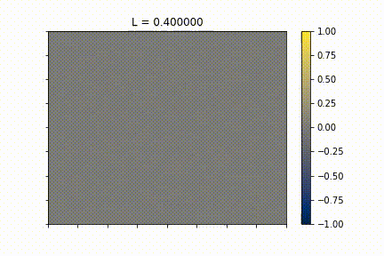
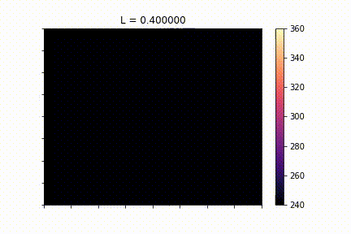
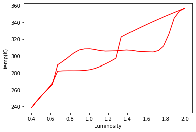
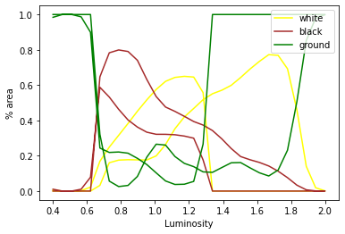

# pixel daisyworld
Pixel daisyworld is an extension of Daisyworld simulation
Daisyworld is a model of an imaginary planet created by Lovelock and Andrew Watson to support the Gaia theory

https://classroom.google.com/u/1/c/NDQzNjQ0NjIwODQz/m/NDQzNjQ0NjIwODgx/details

Implementation of the [pixel][website] yaya

<!--  -->

  

(left) plot of black and white daisies over area.
yellow: white daisy, grey: ground, dark blue: black daisy

(right) plot of temperature over area, 240K to 360K
brighter colour is hotter

<!--  -->

  

(left) average temperature of the environment
(right) average temperature of black/ white daisies and ground

black and white dasies have the same growth curve
temperature of environment is blur
temperature of daisy= temperature of environment + local temperature on daisy

If you find this code useful, please credit `eisbetterthanpi`

[website]: https://github.com/eisbetterthanpi

## Gaia theory
Gaia theory
Actively regulated
Atmosphere constant
Destabalisation life environment interactions lead to local reset
How much life affect the environment vs natural processes

https://www.brookes.ac.uk/geoversity/publications/an-analysis-of-the-impact-of-the-gaia-theory-on-ecology-and-evolutionary-theory
increased biodiversity and increasing stability of populations

#### [Open `pixel_daisyworld.ipynb` in Google Colab](https://colab.research.google.com/github/eisbetterthanpi/python/blob/master/pixel_daisyworld/pixel_daisyworld.ipynb)

## Observations
At high luminosities,
- Large patches of black die and get splitup
- Black surrounded by white survives
- White takeover at high temp	but black dun at low prob bec unsymmetric albedo
- Great heat death is due to expansion of ground cover
- Black starts dying from the center of large patches of black
and the inverse at low luminosities

## Future work
- atmosphere/ depth and convection
- Ocean conveyor belt disruption
- real growth temp curve
- spherical coordinate pixels

